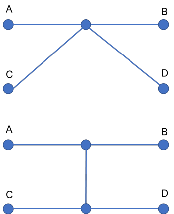
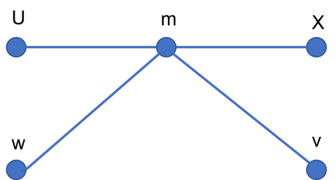

# 트리의 지름

트리의 지름은 트리의 가장 먼 두 정점 사이의 거리를 의미한다.

트리의 지름은 다음과 같은 방법으로 구할 수 있다.

1. 임의의 점 U에서 가장 먼 정점 X를 구한다.
2. X에서 가장 먼 정점 Y를 구한다.
3. X에서 Y까지의 거리가 트리의 지름이다.

<br/>

## :straight_ruler: 타당성 증명

### 알고 가야할 것

- 경로(path) 

  트리에서는 두 정점에 대해 언제나 유일한 *연결* 이 존재함. 이 연결을 경로라고 부름.

- 경로의 길이(length of the path)

  두 정점 v, w 사이의 경로의 길이는 vw로 표현함. 경로에서 각 간선의 길이의 함으로 계산함. 경로는 유일하므로 vw = wv임.

- 트리의 성질

  - 삼각 부등식 : vw <= vm + mw,

    (모든 간선의 길이가 음수가 아니라면 성립)

  - 경로 vw위의 점 m에 대해, vw = vm + mw,

    (모든 간선의 길이가 양수면 성립)

<br/>

### 목표

> If, 
>
> 1. 모든 점 z에 대해, Uz <= UX 다.
> 2. 모든 점 z에 대해, Xz <= XY다.
>
> then,
>
> ​	모든 점 v, w 에 대해, vw <= XY다.

를 증명하는 것.

- 보충 설명
  - 1.은 U에서 가장 먼 정점이 X다. 라는 뜻
  - 2.는 X에서 가장 먼 정점이 Y다. 라는 뜻

<br/>

### 보조정리

> 트리의 모든 정점 A, B, C, D에 대해, 
>
> (경로 AB위의 점) ^ (경로 CD 위의 점) 이거나 
>
> (경로 AD위의 점) ^ (경로 CB 위의 점) 인 점 m이 존재한다.

다시 말해, 경로 AB와 경로 CD가 겹치거나(점을 공유), 경로 AD와 경로 CB가 겹친다.

#### 보조정리 증명

정점 A, B, C, D에 대해, 다음과 같은 2가지 경우가 있다.

1. 경로 AB와 경로 CD가 공유하는 점이 있다.
2. 경로 AB와 경로 CD가 공유하는 점이 없다.


1.의 경우 자명하다.

2.의 경우, 트리이므로, AB와 CD를 연결하는 경로가 있다. 그 경로가 AD와 CB가 공유하는 점이다. 



위의 그림이 1.의 경우

아래의 그림이 2.의 경우

<br/>

### 진짜 증명

보조정리의 의해, 점 u, x, v, w에 대해,

(경로 xv위의 점) ^ (경로 uw 위의 점) 이거나 

(경로 xw위의 점) ^ (경로 uv 위의 점) 인 점 m이 존재한다.




- U에서 가장 먼 정점이 X이므로 Uw <= UX 이다.

- 앞서 나왔던 트리의 성질들에 의해 

  **Um + mw** = Uw <= UX = **Um + Xm** 이다.

- 양변에서 Um을 빼준다.

  **mw <= Xm** 

- 다시 양변에 vm을 더해준다.

  vm + mw <= Xm + mv   (vm = mv임)

  **vw <= Xv** 

- 처음의 가정, 모든 점 z에 대해, Xz <= XY다. 에 의해

  vw <= Xv <= XY이다.

  증명 끝.


## :cookie:코드

```python
# 트리의 정점에 번호가 1부터 n까지 붙어있음
# n : 정점의 개수
# graph : 트리 연결 상태 딕셔너리
# graph[i] = (j, j까지 간선 거리)

def dfs(node, cost):
    visited.add(node)
    for nxt in graph[node]:
        if nxt[0] in visited: continue
        nxt_cost = nxt[1] + cost
        distance[nxt[0]] = nxt_cost
        dfs(nxt[0], nxt_cost)

# 임의의 점에서 가장 먼 정점 x를 찾음
visited = set()
distance = [0] * (n+1)
dfs(1,0)
x = max(range(n+1), key = lambda u : distance[u])

# x에서 가장 먼 정점 까지 거리를 찾음
visited = set()
distance = [0]*(v+1)
dfs(x,0)
print(max(distance))
```


<br/>

## :doughnut: BOJ

[BOJ1167 - 트리의 지름](https://www.acmicpc.net/problem/1167)

[BOJ1967 - 트리의 지름](https://www.acmicpc.net/problem/1967)

