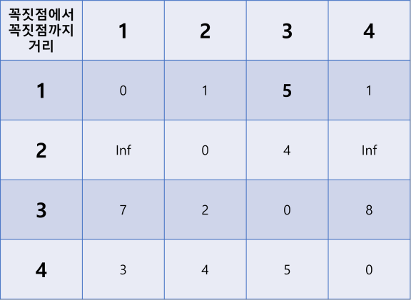

# 플루이드 워셜

>  [위키백과 플로이드 워셜](https://ko.wikipedia.org/wiki/%ED%94%8C%EB%A1%9C%EC%9D%B4%EB%93%9C-%EC%9B%8C%EC%85%9C_%EC%95%8C%EA%B3%A0%EB%A6%AC%EC%A6%98)

## 설명

주어진 그래프에 대해 최단 경로를 찾는 알고리즘!

모든 꼭짓점에서 다른 모든 꼭짓점 까지의 최단 경로를 찾을 수 있다.

다이나믹 프로그래밍을 이용한다.

- 그래프에 `1`부터 `v`까지 번호가 매겨진 꼭짓점들이 있다고 가정하자.

- `i`에서 `j`로 가는데 `{1, 2, ..., k}`중 하나를 거쳐가는 최단 경로를 `SP(i, j, k)`라 하자. 그럼 다음이 성립한다.

  -  ```
     SP(i, j, k) = min( SP(i, j, k-1), 
     				   SP(i, k, k-1) + SP(k, j, j-1))
     ```

  - 1. `k` 를 거쳐가지 않는 경로 (`SP(i, j, k-1)`)와 

    2. `i`에서 `k`까지 최단 경로(`SP(i, k, k-1)`)로 간 다음  , `k`에서 `j`까지 최단 경로로 가는 경로 `SP(k, j, j-1))`

    이 두개를 비교해서 더 짧은 쪽이 최단 경로다.

이를 위해 삼중 for문을 이용한다.


### 주의

가중치가 음이어도 사용할 수 있다. 하지만 음수 사이클이 있으면 최단 경로가 음의 무한으로 갈 수 있다.

시간 복잡도는 O(|V|^3) 꼭짓점의 개수의 세제곱


## 코드

```python
# v : 간선의 개수
# edges : 
#	key = (i, j)  // 간선
#   value = w(i, j)  // 간선 (i, j)의 가중치


# (v x v) 2차원 리스트를 inf로 다 초기화
distance = [[inf for _ in range(v)] for _ in range(v)]

# 꼭짓점 스스로까지의 경로를 0으로 갱신
for vertex in vertices:
    distance[vertex][vertex] = 0
    
# 주어진 간선마다 간선 가중치 갱신
for edge in edges:
    distance[i][j] = w(i, j)
    
# i에서 k를 거쳐 j까지 가는데 걸리는 최단 경로 계산
for k in vertices:
    for i in vertices:
        for j in vertices:
            # 기존의 경로보다 k를 거쳐 가는게 더 빠르면 갱신
            if distance[i][j] > distance[i][k] + distance[k][j]
            	distance[i][j] = distance[i][k] + distance[k][j]
```


## 그림으로 보기

4개의 꼭짓점으로 된 그래프.


2차원 배열 `distance`을 모두 무한대로 초기화한다.


자신에서 자신으로 가는 경로는 0으로, 그래프에 주어진 간선들은 각 가중치로 초기화한다.


- `k = 1`일 때

  점 A에서 1을 거쳐 B로 가는 최단 경로를 구한다!

  기존의 [A에서 B로 가는 경로] 와 [A에서 1로 가는 경로] + [1에서 B로 가는 경로]를 비교한다!

  다음의 6가지 경우를 고려해주면 된다.

  - `2 -> 3` vs `2 -> 1 -> 3` 
    -  `distacne[2][3] = 4` vs `distance[2][1] + distance[1][3] = inf+inf`
  - `2 -> 4` vs ` 2 -> 1 -> 4` 
    -   `distacne[2][4] = inf`  vs `distance[2][1] + distance[1][4] = inf + 1`
  - `3 -> 2` vs `3 -> 1 -> 2` 
    -  `distacne[3][2] = 2` vs `distance[3][1] + distance[1][2] = 7 + 1`
  - `3 -> 4` vs `3 -> 1 -> 4` 
    - `distacne[3][4] = inf  ` vs `distance[3][1] + distance[1][4] = 7 + 1`
  - `4 -> 2` vs `4 -> 1 -> 2` 
    - `distacne[4][2] = inf` vs  `distance[4][1] + distance[1][2] = 3 + 1`
  - `4 -> 3` vs `4 -> 1 -> 3` 
    -   `distacne[4][3] = 5`  vs `distance[4][1] + distance[1][3] = 3 + inf`

  그 결과는

  

  

- `k = 2`일 때, 위에서 갱신된 최단 경로들을 이용해 다시한번 계산한다.

  다음의 6가지 경우를 고려해주면 된다.

  - `1 -> 3` vs `1 -> 2 -> 3` 
    -  `distacne[1][3] = inf ` vs `distance[1][2] + distance[2][3] = 1 + 4`
  - `1 -> 4` vs ` 1 -> 2 -> 4` 
    -   `distacne[1][4] = 1`  vs `distance[1][2] + distance[2][4] = 1 + inf`
  - `3 -> 1` vs `3 -> 2 -> 1` 
    -  `distacne[3][1] = 7` vs `distance[3][2] + distance[2][1] = 2 + inf`
  - `3 -> 4` vs `3 -> 2 -> 4` 
    - `distacne[3][4] = inf  ` vs `distance[3][2] + distance[2][4] = 2 + inf`
  - `4 -> 1` vs `4 -> 2 -> 1` 
    - `distacne[4][1] = 3` vs  `distance[4][2] + distance[2][1] = inf + inf`
  - `4 -> 3` vs `4 -> 2 -> 3` 
    -   `distacne[4][3] = 5`  vs `distance[4][2] + distance[2][3] = inf + 4`

  그 결과는

  

- `k = 3` 일 때의 결과는

  

- 이 그래프의 경우는  `k = 4`일 때 갱신되는 값 없이 3중 for문이 끝난다!

  최종 최단경로 배열은 다음과 같다.

  


## BOJ 11404 플로이드

[BOJ 11404 플로이드](https://www.acmicpc.net/problem/11404), 플로이드 워셜 알고리즘을 이용하는 문제다!

### 풀이 코드

```python
import sys
input = sys.stdin.readline
INF = 1e8

v = int(input().rstrip())
e = int(input().rstrip())
graph = [[INF]*(v+1) for _ in range(v+1)]

for x in range(1, v+1):
    graph[x][x] = 0

for _ in range(e):
    a, b, c = map(int ,input().split())
    graph[a][b] = min(c, graph[a][b])

for k in range(1, v+1):
    for a in range(1, v+1):
        if a == k: continue # 계산 불필요
        if graph[a][k] == INF: continue # a->k 길이 없으면 어차피 a->k->b도 없음
        for b in range(1, v+1):
            if b == k or a == b : continue # 계산 불필요
            if graph[k][b] == INF : continue # k->b 길이 없으면 어차피 a->k->b도 없음
            graph[a][b] = min(graph[a][b] ,graph[a][k] + graph[k][b])

for row in graph[1:]:
    print(' '.join(map(lambda x: '0' if x==INF else str(x), row[1:])))
```