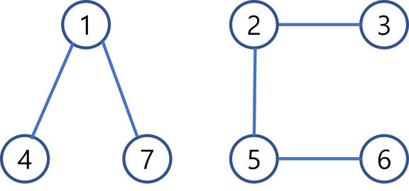
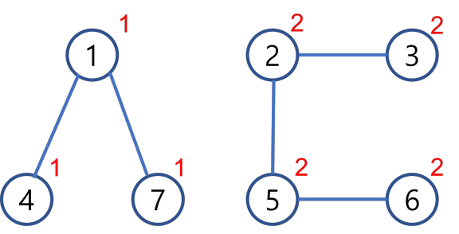

# Union find

## :bread:설명

주어진 노드들에 대해서, 두 노드가 같은 그래프에 속하는지(연결되어있는지?) 알아내는 알고리즘이다.



위와 같은 그래프가 있다면

- `[2, 3, 5, 6]`은 같은 연결 그래프에 속한다.

- `[1, 4, 7]`은 같은 연결 그래프에 속한다.

같은 그래프에 속하는지를 표현하기 위해 리스트에 각 노드들의 루트 노드를 저장한다. 어떤 두 노느의 루트 노드가 서로 같다면, 두 노드는 같은 그래프에 속한다!

여기서는 서로 연결되어있는 노드들 중 가장 작은 노드를 루트 노드로 정한다.

그럼 위의 그림과 같은 그래프에서 각 노드의 루트 노드를 표시해보면,



이렇게 된다.

왼쪽의 그래프에서는 1, 4, 7 중 1이 제일 작으니 세 개의 루트 노드 모두 1이되고, 오른쪽의 그래프에서는 2, 3, 5, 6 중 2가 제일 작으니 2가 루트 노드가 된다.

<br/>


## :cookie:알고리즘

`Union`(두 노드가 속한 집합을 합집합)과 `Find`(두 노드의 루트 노드를 찾아 같은 집합인지 확인) 두 가지 알고리즘을 사용한다.

- `Find` : 재귀적으로 자신의 루트 노드를 찾는다.
- `Union` : 두 노드를 합치는데, 두 노드의 루트 노드를 찾아서 루트 노드가 서로 다르다면(연결되어 있지 않다면) 더 작은 쪽을 루트 노드로 한다.


### `find`

`find` 함수는 재귀적으로 자신의 루트 노드를 찾아간다.

```python
def find(node):
    # index의 루트노드를 재귀적으로 찾음
    if parent[node] == node: 
        return node
    parent[node] = find(parent[node])
    return parent[node]
```

`parent[node]`, 자신의 부모 노드가 자기 자신일 때까지 루트 노드를 찾아간다.


### `Union`

`Union` 함수는 입력 받은 두 노드를 같은 그래프로 합치는 함수다. 

그 방법은 

1.  `find`로 두 노드의 루트 노드를 찾는다.
2.  두 노드의 루트 노드를 비교한다.
3.  다르다면 둘 중 더 작은 쪽을 루트 노드로 한다.

```python
def union(x, y):
    # x와 y를 같은 집합으로
    x = find(x)
    y = find(y)

    if x == y:  # 이미 루트 노드가 같음
        return

    if parent[x] > parent[y]:
        parent[x] = y
    else:
        parent[y] = x
```

<br/>


## :hamburger: 코드

전체적인 코드를 보자.

```python
def find(node):
    # index의 루트노드를 재귀적으로 찾음
    if parent[node] == node: 
        return node
    parent[node] = find(parent[node])
    return parent[node]

def union(x, y):
    # x와 y를 같은 집합으로
    x = find(x)
    y = find(y)

    if x == y:
        return

    if parent[x] > parent[y]:
        parent[x] = y
    else:
        parent[y] = x


# idx의 부모를 표시하는 리스트
# 자기자신을 부모로 초기화
parent = [i for i in range(8)]

union(1, 4)
union(1, 7)
union(2, 3)
union(2, 5)
union(5, 6)

print(parent) # [0, 1, 2, 2, 1, 2, 2, 1]
```


### 위 코드에 대한 설명

- `parent = [i for i in range(8)]`

  우선 자기자신을 부모로 하는, 즉 아무 연결도 되지 않은 그래프를 생성한다. (0부터 시작해서 인덱스를 맞춰줌)

- ```python
  union(1, 4)
  union(1, 7)
  union(2, 3)
  union(2, 5)
  union(5, 6)
  ```

  0과 2를 연결, 2와 3을 연결, 4와 5를 연결, ... ,9와 7을 연결한다.

- `parent`를 확인해보면 각 인덱스마다 자신의 루트 노드인

  `[0, 1, 2, 2, 1, 2, 2, 1]`가 나온다.

- 사실 루트 노드가 바로 나올 수 있었던 것은 union하는 순서가 적절했기 때문이다. 숫자가 작은 노드부터 union을 진행했기 때문에 바로 루트 노드가 나왔다.

  ```python
  union(1, 4)
  union(1, 7)
  union(2, 3)
  union(5, 6)
  union(2, 5)
  ```

  위와 같이 union의 순서를 마지막 두 개를 바꾸고 `parent`를 확인해보면 `[0, 1, 2, 2, 1, 2, 5, 1]`가 나온다.

  `union(5, 6)`을 먼저 진행했기 때문에 6의 루트 노드는 2로 갱신되지 못했다.

  따라서 정확한 루트 노드를 알고 싶다면 앞에서부터 find를 한 후 확인해야한다.

  ```python
  for idx in range(8):
      find(idx)
  ```

