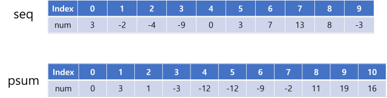
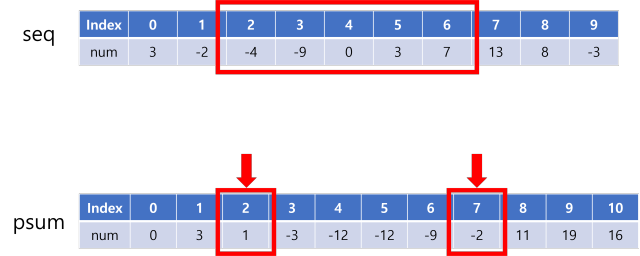

# 구간 합 (Prefix sum)


주어진 수열에서 i번째 값부터 j번째 값까지의 합을 구간 합(Prefix sum)이라고 한다.

반복문을 이용해 i부터 j까지 더하는 건 O(N)이다.

가능한 모든 구간 합을 구해야 한다면 O(N^2)이 걸린다.


따라서 구간 합을 여러 번 구해야하는 경우는 구간 합 알고리즘을 이용한다.


## :bread: 구간 합 알고리즘

- 주어진 수열의 누적 합을 미리 계산해둔다.

  예를 들어, seq = [3, -2, -4, -9, 0, 3, 7, 13, 8, -3] 와 같은 수열이 있다면,

  psum = [0, 3, 1, -3, -12, -12, -9, -2, 11, 19, 16]을 구한다.

  

## :cookie: 코드

```python
seq = [3, -2, -4, -9, 0, 3, 7, 13, 8, -3]
psum = [0]

now = 0
for num in seq:
    now += num  # seq의 앞에서부터 하나씩 더해가면서
    psum.append(now)  # psum에 저장
```





<br/>


- i번째 값부터 j번째 값 까지의 합을 구하려면,

  `psum[j+1] - psum[i]` 으로 한 번에 계산할 수 있다.

  예를 들어 `seq`의 2번째 인덱스인 `-4` 부터 6번째 인덱스인 `7`까지의 합을 구하려면

  `psum[7] - psum[2]` = -2 - 1 = -3 이다.
  
  

```python
sum2to6 = psum[7] - psum[2]
```




<br/>

---

<br/>

## :hamburger: BOJ 문제

### BOJ 2559번 : 수열

[BOJ 2559번 : 수열](https://www.acmicpc.net/problem/2559)

```python
import sys
input = sys.stdin.readline

n, k = map(int, input().split())
temper = list(map(int, input().split()))

psum = [0]
now = 0
for i in range(n):
    now += temper[i]
    psum.append(now)

result = -10000001
for j in range(n-k+1):
    result = max(result, psum[j+k]-psum[j])

print(result)
```

### BOJ 11441번: 합 구하기

[BOJ 11441번: 합 구하기](https://www.acmicpc.net/problem/11441)

```python
import sys
input = sys.stdin.readline

n = int(input())
numbers = list(map(int, input().split()))

now = 0
prefix = [0]
for i in range(n):
    now += numbers[i]
    prefix.append(now)

m = int(input())

for _ in range(m):
    i, j = map(int, input().split())
    print(prefix[j] - prefix[i-1])
```

