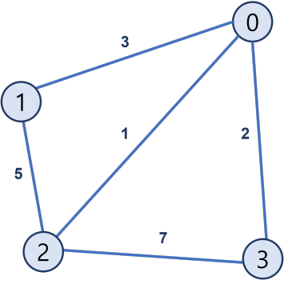
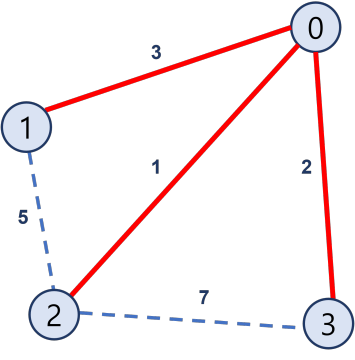
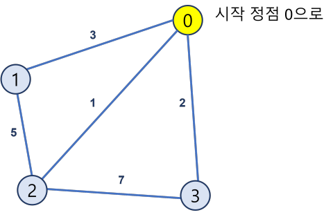
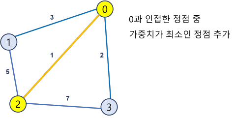
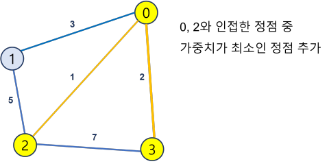
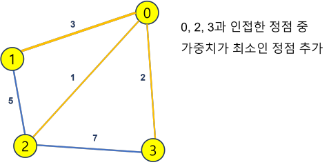

# 최소 스패닝 트리

## 스패닝 트리

스패닝 트리란 그래프의 모든 정점을 포함하고 있는 트리이다.

그 중 최소 스패닝 트리는 스패닝 트리 중 가중치의 총합이 최소인 스패닝 트리이다.

즉 주어진 그래프에 대해, **가장 적은 비용으로 모든 노드를 연결한 그래프**이다.



위와 같은 트리가 있을 때 최소 스패닝 트리는 가중치가 1, 2, 3인 간선만을 골라 만드는 트리다.




최소 스패닝 트리를 찾는 알고리즘으로

- 프림 알고리즘 (Prim's algorithm)
- 크루스칼 알고리즘 (Kruskal Algorithm)

이 있다.


## [프림 알고리즘](https://ko.wikipedia.org/wiki/%ED%94%84%EB%A6%BC_%EC%95%8C%EA%B3%A0%EB%A6%AC%EC%A6%98)

### 수행 순서

1. 하나의 꼭짓점을 선택해 새로운 트리를 만든다.

2. 모든 꼭짓점이 트리에 포함되어있지 않는 동안

   트리에 속하지 않은 정점들 중 트리에 가장 가까운 정점을 골라 트리에 추가한다. (이 과정에서 우선순위 큐를 이용한다.)

### 코드

```python
# v: 정점의 개수

INF = 1e10  # 무한

def prim(start):
    visited = [False] * (v+1)   # 트리에 추가한 정점 표시
    heap = [(0, start, -1)]  # 가중치, 노드, 부모 저장
    weight = 0  # 총 가중치
    tree = []   # 트리
    while heap:
        dist, node, parent = heapq.heappop(heap)
        
        # 이미 트리에 포함됐으면 건너뜀
        if visited[node]:                 
            continue
            
        visited[node] = True              
        weight += dist                    
        tree.append((parent, node))       # 트리에 간선 (부모, 노드) 저장

        for nxt, cost in graph[node]:     # 현재 정점과 이웃한 정점 중
            if visited[nxt]:              # 트리에 포함되었으면 건너뜀
                continue
            heapq.heappush(heap, (cost, nxt, node))
    
    return weight, tree
```

### 그림으로 확인하기

- 시작 정점을 heap에 넣는다.
  - `heap = [(0, 0, 0)]`

#### Step1.

- heap에서 가중치가 최소인 정점 정보 `(0, 0, 0)` 을 꺼내고 방문 처리.

  - `heap = []`

  



- 정점 0과 인접한 모든 정점 정보를 heap에 넣는다.
  - `heap = [(1, 2, 0), (2, 3, 0), (3, 1, 0)]`

#### Step2.

- heap에 담긴 정점 중 가중치가 최소인 정점 정보 `(1, 2, 0)` 를 꺼내고 트리에 추가
  - `heap = [(2, 3, 0), (3, 1, 0)]`




- 꺼낸 정점 2와 인접한 모든 정점 정보를 heap에 넣는다.
  - `heap = [(2, 3, 0), (3, 1, 0), (5, 1, 2), (7, 3, 2)]`

#### Step3.

- heap에 담긴 정점 중 가중치가 최소인 정점 정보 `(2, 3, 0)`을 꺼내고 트리에 추가

  - `heap = [(3, 1, 0), (5, 1, 2), (7, 3, 2)]`

    



- 꺼낸 정점 3과 인접한 모든 정점 정보를 heap에 넣는다.
  - `heap = [(3, 1, 0), (5, 1, 2), (7, 3, 2)]`

#### Step4.

- heap에 담긴 정점 중 가중치가 최소인 정점 정보 `(3, 1, 0)`을 꺼내고 트리에 추가



## 크루스칼 알고리즘

- 가중치가 가장 작은 간선부터 그래프에 포함시켜 간다.
- union find를 이용한다.

### 수행 순서

1. 가중치가 가장 작은 간선을 찾는다.

2. 간선을 포함해도 사이클이 발생하지 않는다면 포함시킨다.

3. 사이클이 발생한다면 포함하지 않는다.


## 코드

```python
# union, find
def find(node):
    # index의 루트노드를 재귀적으로 찾음
    if parent[node] == node: 
        return node
    parent[node] = find(parent[node])
    return parent[node]

def union(x, y):
    # x와 y를 같은 집합으로
    x = find(x)
    y = find(y)

    if x == y:
        return

    if parent[x] > parent[y]:
        parent[x] = y
    else:
        parent[y] = x
        

```

```python
def kruskal(graph):
    weight = 0
    tree = []
    graph = sorted(graph)
    for edge in graph:
        cost, a, b = edge
        # a와 b가 서로 다른 집합일 때, 즉 간선(a, b)로 사이클이 발생하지 않을 때
        if find(a) != find(b):
            union(a, b)
            weight += cost
            tree.append((a, b))
            
    return weight, tree

# e: 간선 개수
# 그래프 입력받기
graph = []
for _ in range(e):
    a, b, cost = map(int, input().split())
    graph.append((cost, a, b))

# 간선 가중치 기준으로 정렬
graph.sort()

# union find용 루트 노드 저장
# 자기 자신을 루트 노드로 초기화
parent = [i for i in range(v + 1)]

kruskal(graph)
```

