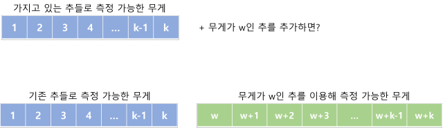
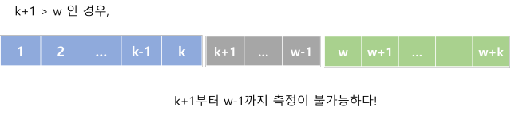
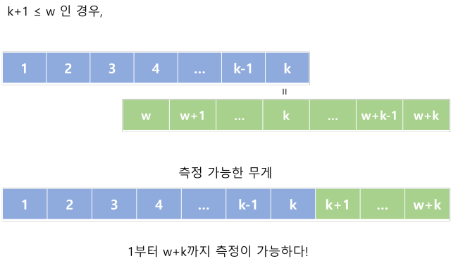

# 저울 문제

- 주어진 추들을 이용하여 측정할 수 없는 가장 작은 정수값을 구하는 문제
- [BOJ - 2437](https://www.acmicpc.net/problem/2437)

- 탐욕 알고리즘으로 풀 수 있다.

## 첫번째 접근 방법

- 무게 w를 1부터 하나씩 키워가면서 w를 주어진 추들로 측정할 수 있는지 확인했다.

- 주어진 추들로 측정할 수 있는지 확인하는 방법은

  무게가 무거운 추들부터 w에서 빼주면서 w가 0이 될 수 있는지 확인했다.


- ```python
  # n : 추들의 개수
  # weights[n] : 추들의 무게 배열
  
  weights.sort(reverse=True) # 내림차순 정렬
  
  for w in range(1, sum(weights) + 2):
  	for weight in weights:
  		if w >= weight:
  			w = w - weight
  		if w == 0:
  			# 측정 가능
  			break
  		
  	# 측정 불가능
  	print(w)
  ```

- 해당 방법으로는 추의 무게의 범위가 큰 경우 시간초과가 발생했다.


## 두번째 접근 방법

- 기존에 측정 가능한 값이라고 판단된 w들을 이용하면 반복 연산을 줄이고 시간을 단축시킬 수 있다는 생각이 들었다.

- 따라서 가벼운 무게부터 측정 가능한지 판단을 하면서 그 값을 저장해두고 새롭게 측정 가능한 무게를 구하고자 했다.

- 특히 우리는 측정할 수 없는 가장 작은 무게를 구하려고 하므로, 측정할 수 있는 가장 큰 무게를 저장하고 있으면 된다.

- 1 ~ k까지의 무게를 측정할 수 있다고 가정하자. 무게가 w인 새로운 추를 사용한다면, w ~ w+k까지의 무게가 새롭게 측정 가능해진다.

  만약 w > k+1이라면, 측정이 불가능한 공백이 생긴다.

  반대로 w <= k+1이라면, 1 ~ w + k까지 측정이 가능해진다.

### 그림










### 코드

```python
# n : 추들의 개수
# weight[n] : 추들의 무게 배열

weight.sort()  # 오름차순 정렬
max_value = 0  # 현재까지 측정할 수 있는 가장 큰 무게
for num in weight:
    if num <= max_value + 1:
        max_value += num
    else:
        break
print(max_value + 1)
```

